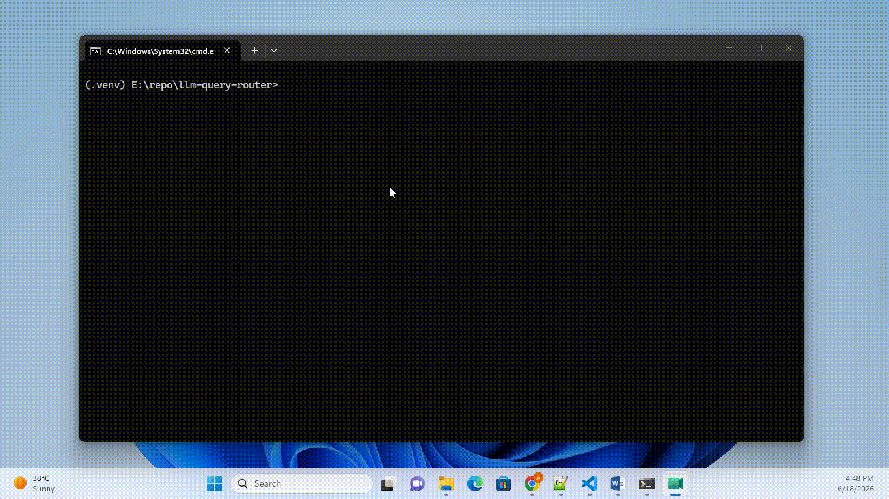

# arbiter

[](https://github.com/arpitjain310/arbiter/actions/workflows/ci.yml)

> A routing engine that classifies a query, decides which backends to hit,
> fans out in parallel, and **degrades gracefully** on failure — with
> cost/latency budgeting, a structured fallback ladder, and an eval harness
> that proves routing quality with precision and recall.

**Status:** v0.1.0. Classification, parallel fan-out, merge, the fallback
ladder, cost/latency budgeting, tracing with JSONL export, and precision/recall
evals run against mock backends, with a SQLite backend wired behind the same
contract.

## Demo



A query routes to `sql`. With `sql` forced down, the route doesn't raise — it
steps down the fallback ladder: retry the primary, then route to a backend the
classifier had dropped, which answers. The trace records the rungs taken
(`fallback=['primary', 'retry', 'secondary']`). Then the eval harness prints
routing precision/recall against a route-all baseline.

---

## The problem

"Pick a backend and call it" is a demo. The engineering is everything around it:

- **Under-route** (miss a needed backend) → wrong or incomplete answer — a
  correctness failure.
- **Over-route** (hit backends you didn't need) → unnecessary latency and cost,
  and an eval metric that cannot tell good routing from lazy routing.

The router navigates that tradeoff. The eval harness proves it did so well.

## What it does

```
query ─▶ classify ─▶ budget ─▶ fan out (parallel) ─▶ merge ─▶ response
            │           │              │                │
            │           │              │                └─ all backends failed?
            │           │              │                   → graceful FALLBACK
            │           │              └─ per-backend timeout enforced here
            └───────────┴──── every stage emits a trace span
                              (latency + cost roll up to the route total)

evals/ ── run the router over a labeled dataset ──▶ precision, recall,
                                                     degradation rate,
                                                     latency, cost
```

- **Backend abstraction** (`backend.py`) — one contract; each source (SQL,
  vector, web, API) implements it. Failures surface as `Result(error=...)`,
  never exceptions, so the router degrades instead of crashing.
- **Classifier** (`classify.py`) — score backends by relevance, pick the right
  ones, never return empty.
- **Budget** (`budget.py`) — drop backends that exceed the cost or latency
  ceiling before fan-out.
- **Router** (`router.py`) — classify → budget → parallel fan-out → merge →
  fallback.
- **Observability** (`observability.py`) — in-process tracer with the right
  shape; swap the exporter for OpenTelemetry or LangSmith.
- **Eval harness** (`evals/harness.py`) — precision and recall over a labeled
  dataset; a regression gate in CI fails the build when routing quality drops.

## Explicit non-goals

- Not a general agent framework — it routes queries, not multi-step plans.
- No live API spend during development — backends are **mocked**; one real
  backend (SQLite) is wired to prove the contract holds against real storage.
- Not a vector DB or a search engine — it routes *to* them.
- The classifier starts heuristic; swapping in an LLM is a backend detail, not
  a rewrite.

## Fallback ladder

When a backend fails or times out, the router does not crash — it steps down a
designed sequence:

```
primary call fails / times out
    → retry once with backoff
    → route to the next-best backend the budget dropped
    → degraded response with disclosure
```

Each rung is a tested path. `RouterResponse` records which backends were chosen,
dropped by the classifier, dropped by the budget, and which fallback rungs were
taken — so "why did it route this way" is always answerable.

## Routing quality

Routing accuracy is measured as **precision and recall**, not a subset check:

- **Subset check** (naive): `expected ⊆ routed-to` → over-routing scores 100%.
  A router that hits every backend every time looks perfect.
- **Precision**: of the backends routed to, what fraction were actually needed?
- **Recall**: of the backends needed, what fraction were routed to?

The eval dataset includes ambiguous, multi-intent, and keyword-free cases — the
ones a naive heuristic gets wrong — so the score has headroom instead of pinning
at 100%. A **route-all baseline** runs on the same dataset, and the numbers mean
something because there is a worse one beside them:

| strategy | precision | recall | latency | cost |
|----------|-----------|--------|---------|------|
| threshold classifier | **80%** | 81% | 47ms | $0.0007 |
| route-all baseline | 33% | 100% | 120ms | $0.0030 |

Routing to everything maxes recall by brute force but drops precision — and
pays for it in latency and cost. A pytest **regression gate** asserts precision and recall clear a
threshold, so routing quality fails CI when it drops.

## Real backend

The engine is backend-agnostic. SQLite is the one real backend:

- Routes `SELECT COUNT(*)` and structured lookups against a real on-disk
  database.
- Zero infrastructure cost; proves the `Backend` contract works against real
  storage and gives the eval harness one real latency measurement to report.

## Quickstart

```bash
python -m venv .venv && . .venv/bin/activate   # Windows: .venv\Scripts\activate
pip install -e ".[dev]"
pytest -q
arbiter "count the rows in the orders table"
arbiter "count the rows in the orders table" --provider sqlite
python -m router.evals.harness
```
